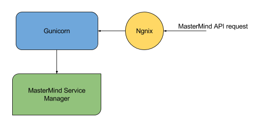
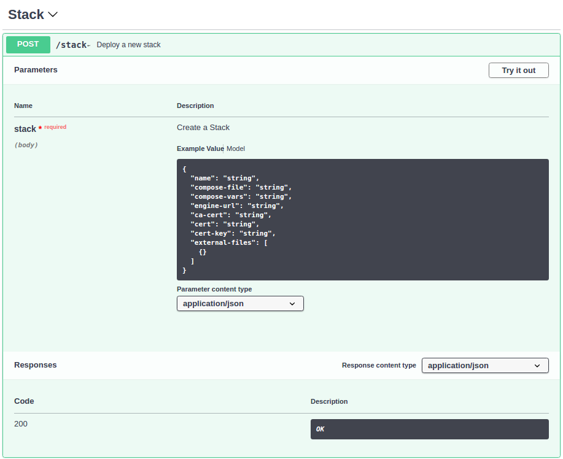

#MasterMind Service Manager

## Introduction

The Mastermind Service Manager is a microservice that is in charge of the deployment of Docker [stacks](https://docs.docker.com/get-started/part5/#prerequisites) to remote Docker Swarm clusters. It comprises of a [Swagger](https://swagger.io/) generated  API for receiving incoming requests and a custom made Python Docker library that leverages [docker-py](https://docker-py.readthedocs.io/en/stable/) and [pyyaml](http://pyyaml.org/wiki/PyYAML) in order to read and parse a docker-compose file, verify if there is any missing Docker component (e.g. Volumes and Networks) and deploy the services described in the docker-compose file on the target engine.

This is an internal component in the MasterMind architecture and as such it is not visible to end users of Mastermind. More specifically, a user must send a request to MasterMind API which then will be forwarded to the Service Manager. This component is described in detail here as it may be of use in other cases; the docker-engine API does not provide functionality required to deploy a stack - that was the reason this component was developed.

### High-level architecture

The picture above depicts the high-level architecture of the MasterMind Service Manager which is comprised of three major components - [Nginx](https://www.nginx.com/), [Gunicorn](http://gunicorn.org/) and the [Service Manager](https://github.com/icclab/MasterMind-ServiceManager). As mentioned above the Service manager comprises of a Swagger API for receiving incoming requests, this API is based on [Flask](http://flask.pocoo.org/) micro-framework which handles one request at a time, and by leveraging Nginx and Gunicorn the overall performance of the service is increased to allow multiple requests to be served at a time.

## Currently supported API endpoints - MasterMind Service Manager

* `POST /v1/stack` - Create a new stack deploying services, creating networks, volumes, secrets and configs defined in the docker-compose file.

* `POST /v1/stack/{name}` - Return the status of an existing stack with the services currently running in the Stack and the total amount of replicas.

* `POST /v1/stack/delete/{name}` - Delete the stack removing services and networks. Note that volumes, secrets and configs are not deleted.

The above image depicts a `POST` request to the `/v1/stack` endpoint. A set of parameters are given as strings plus a key-value mapping JSON object for this endpoint:

* **name:** Name of the stack - this is equivalent to the stack_name parameter used in a docker stack deploy command; 

* **compose-file:** A string containing the entire docker-compose file in yaml format; Variables may be referenced in this file which are obtained from compose-vars; The syntax used for variable substitution is analogous to docker-compose, i.e. `${VARIABLE}`.

* **compose-vars:** Also a string in yaml format containing the a key-value mapping of the variables previously defined. 

* **engine-url:** Swarm manager docker engine url. For example: `tcp://swarmmanager.zurich.fiwarelab.org:2376`

* **ca-cert:** A string containing the ca.pem certificate protecting the docker-engine. 

* **cert:**  A string containing the cert.pem certificate protecting the docker-engine.

* **cert-key:** A string containing the key.pem certificate protecting the docker-engine.

* **external-files:** An array of JSON objects containing all external files required by the compose-file, .i.e secrets and configs. The JSON object syntax should be `{‘filename’: ‘file_content’}`.

The IP address of the Swarm manager can be found in the [Rancher](http://rancher.com/) interface under the tab Infrastructure -> Hosts (More details below). Note that a swarm may have more than one manager: in this case, any of the swarm managers could be chosen. The default port used by Docker engine is 2376 and this is the port usually used in the engine-url parameter. *Note that responsibility for ensuring this port is open on the VM lies with the user - it may require specifically setting up security groups and/or other firewall rules to ensure these ports are accessible*.

## Security

In order to safely connect to a remote Docker engine, the Mastermind Service Manager requires TLS certificates to protect the connection to the remote Docker engine. [This is a common practice in Docker](https://docs.docker.com/engine/security/https/).

[Rancher](http://rancher.com/) makes use of docker-machine which automatically generates certificates and protects the engine for every host created - note that this does not apply for custom hosts, i.e. hosts which are not created using docker-machine. 

All certificates can be easily retrieved from Rancher’s UI, in the Infrastructure -> Hosts page select the host which has the label `swarm=manager` and at the top right section there is a button to edit the Host, click on it then click on `Machine Config`. This will download a zip file containing all certificates and keys that can be used to access the host.

## Docker Compose Reference - Parameters Supported by the Service Manager

The Docker compose file format is quite complex, reflecting the complexity of container systems. The Mastermind Service Manager does not currently support all parameters defined in docker-compose. Below, the set of supported parameters is provided.

<table>
  <tr>
    <td>Services</td>
    <td></td>
  </tr>
  <tr>
    <td>command</td>
    <td>Either an array or a string. For example: "command param1 param2" or ["command", “param1”, “param2”]</td>
  </tr>
  <tr>
    <td>configs</td>
    <td>Either the short or the long syntax are supported. <a href='https://docs.docker.com/compose/compose-file/#configs'>For more information click here</a></td>
  </tr>
  <tr>
    <td>deploy[labels]</td>
    <td>A JSON object containing the labels for the service. <a href='https://docs.docker.com/compose/compose-file/#labels-1'>For more information click here</a></td>
  </tr>
  <tr>
    <td>deploy[mode]</td>
    <td>Networking mode to be associated to the service. Either ‘global’ or ‘replicated’ as defined in the docker-compose reference documentation.</td>
  </tr>
  <tr>
    <td>deploy[placements]</td>
    <td>An array of constraints for deploying the service. <a href='https://docs.docker.com/compose/compose-file/#placement'>For more information click here</a>.</td>
  </tr>
  <tr>
    <td>deploy[replicas]</td>
    <td>Amount of containers that should be running for the service. If enabled this option will set the mode to replicated.</td>
  </tr>
  <tr>
    <td>deploy[restart_policy]</td>
    <td><a href='https://docs.docker.com/compose/compose-file/#restart_policy'>For more information click here.</a></td>
  </tr>
  <tr>
    <td>deploy[update_config]</td>
    <td><a href='https://docs.docker.com/compose/compose-file/#update_config'>For more information click here.</a></td>
  </tr>
  <tr>
    <td>entrypoint</td>
    <td>Override the default entrypoint.</td>
  </tr>
  <tr>
    <td>environment</td>
    <td>An array of strings containing environment variables for the service. Key-value mapping format currently not supported. <a href='https://docs.docker.com/compose/compose-file/#environment'>For more information click here</a>.</td>
  </tr>
  <tr>
    <td>healthcheck</td>
    <td><a href='https://docs.docker.com/compose/compose-file/#healthcheck'>For more information click here</a></td>
  </tr>
  <tr>
    <td>image</td>
    <td>Specify the image to start the container from. Can either be a repository/tag.</td>
  </tr>
  <tr>
    <td>labels</td>
    <td>Labels to be associated with the container of the service. It can be either an array or a key-value mapping JSON object.</td>
  </tr>
  <tr>
    <td>networks</td>
    <td>Array of network names to be associated to the service.</td>
  </tr>
  <tr>
    <td>ports</td>
    <td>Array of strings, currently supported syntax: "8000:8000"</td>
  </tr>
  <tr>
    <td>secrets</td>
    <td>Either the short or the long syntax are supported. <a href='https://docs.docker.com/compose/compose-file/#secrets'>For more information click here</a></td>
  </tr>
  <tr>
    <td>volumes</td>
    <td>Array of volumes to be attached to the service. Could have the following syntax: - “volume_name”, - "volume_name:/path/to/file", - “volume_name:/path/to/file:ro”</td>
  </tr>
  <tr>
    <td>Networks and Volumes</td>
    <td></td>
  </tr>
  <tr>
    <td>driver</td>
    <td>Defaults to ‘local’ for volumes and ‘overlay’ for networks.</td>
  </tr>
  <tr>
    <td>driver_opts</td>
    <td>A key-value mapping of options for the driver.</td>
  </tr>
  <tr>
    <td>external</td>
    <td>If set to true, specifies that this volume has been created outside of Compose and therefore won’t be created by the service manager. Raises an exception in case the volume or network does not exist.</td>
  </tr>
  <tr>
    <td>labels</td>
    <td>Labels to be associated to the volume or network. It can be either an array or a key-value mapping JSON object.</td>
  </tr>
  <tr>
    <td>Secrets and Configs</td>
    <td></td>
  </tr>
  <tr>
    <td>file</td>
    <td>Name of the file that used to create the secret or config. The service manager will check the ‘external_files’ parameter and get the file content.</td>
  </tr>
</table>

## Known issues

There is a known bug in newer versions of Docker engine preventing the deployment of stacks to a Swarm cluster. The stack will be deployed but no actual containers will start, hanging on ‘Pending’ status. For more information about the bug please visit [#35093](https://github.com/moby/moby/issues/35093) and [#2396](https://github.com/docker/swarmkit/pull/2396).

